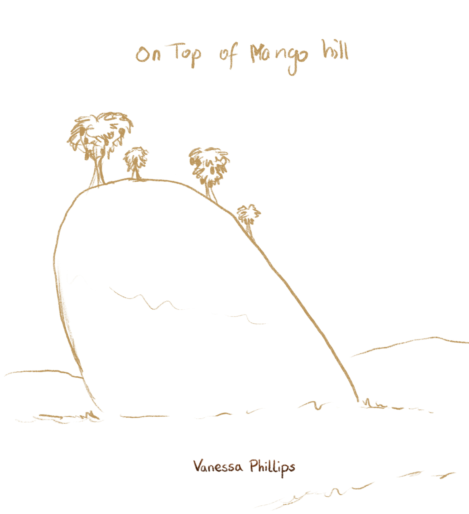

## „Ontop of Mango Hill“

### Oben auf dem Mango Berg

Dieses Bild entstand durch die ‘Imaginary Bookcover Challenge' auf Instagram. Hier wurden verschiedene fiktive Buchtitel vorgegeben, zu denen ein Buchcover entworfen werden sollte.
Viele Illustratoren haben auch eine Idee beigesteuert, um was es in dem Buch gehen könnte.

Hier dachte ich an eine Gruppe Ameisen die einen Mango Hain pflegen der auf einem Mangoförmigen Hügel wächst.

Skitze

Finish

