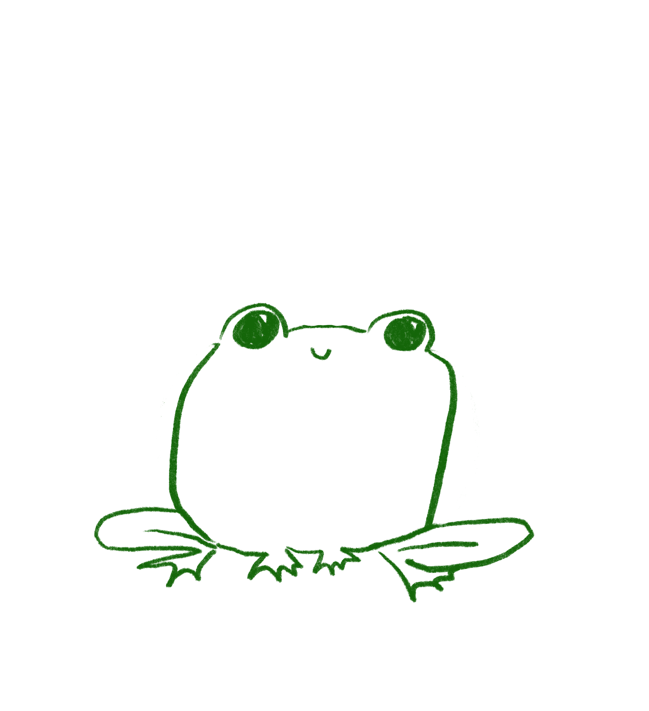
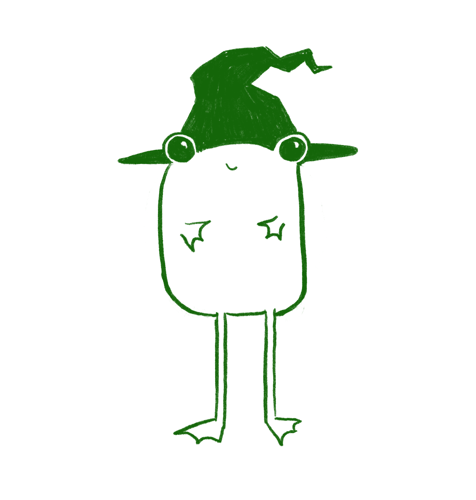

## Kleiner Frosch oder Little Frog

Sie ist der Hauptcharakter meiner Kurzgeschichten, die ich über meinen [Newsletter](/newsletter) verschicke. 
Sie lebt in einem kleinen Haus an einem kleinen Teich und ihre Lieblingsfarbe ist Gelb. 

Endwurfs Prozess:

Der erste Entwurf war noch relativ rechteckig...

Um das ganze etwas interessanter zu machen habe ich verschiedene Hüte ausprobiert und der Hexenhut passte am besten.

Die Langen Beine ergeben einen schönen Kontrasst zu dem breiten Körper.

Die Farbgebung sollte eine angenehme Textur haben um einen Bilderbuch Charakter zu erziehlen.

Langsam ergab sich so die passende Farbgebung.

Letztlich wurde die Form noch etwas abgerundet und 'Little Frog' bekam ihr entgültiges Aussehen.
